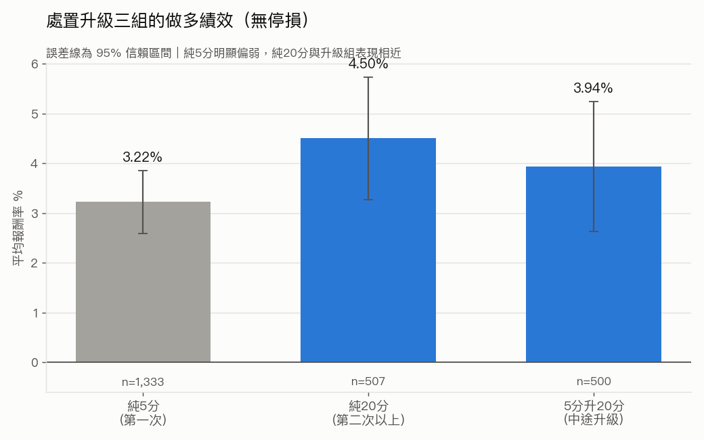

# 處置股做多策略

以台灣證交所／櫃買中心官方公布的**處置股清單**為進場訊號，於處置期間內進場、
持有到出關（`period_end`）出場的做多策略。

**研究期間：2026/07/13 – 2026/07/19**

---

## 最終策略設定

| 參數 | 值 | 說明 |
|---|---|---|
| `entry_day_index` | **5** | 處置期間第 5 個交易日進場 |
| `entry_price_mode` | **open** | 以進場日開盤價成交 |
| 停損 | **無** | 不設停損，持有至 `period_end` |
| 出場 | `period_end` 當日收盤價 | 抱到出關 |
| 手續費 | 0.001425 x 0.2 折 | 買賣雙邊各收一次 |
| 證交稅 | 0.003（全額） | 僅出場收一次（跨日持倉，無當沖優惠） |
| 滑價 | 0.1% | 基準情境 |
| 本金 | 1,000,000 元／筆 | 連續金額試算 |

> 前一版曾採 9% 動態停損，經配對檢定顯示停損反而提早砍掉回檔的贏家、
> 整體報酬較低（平均 2.10% vs 無停損 3.65%），故改為無停損。9% 停損版本的
> 完整數字與分析見 [RESEARCH.md](RESEARCH.md)「已測試的前版本」。

---

## 最終績效摘要

| 指標 | 值 |
|---|---|
| 樣本數（交易筆數） | 2,340 |
| 勝率 | 59.8% |
| 平均報酬率 | **3.65%** |
| 中位數報酬率 | 2.88% |
| 報酬率標準差 | 13.02% |
| 平均 pnl_ntd | 36,524 |
| 總 pnl_ntd | 85,465,816 |
| 平均持有天數 | 6.19 |

> 無停損換來較高報酬，代價是尾部風險較大——最壞單筆可達 -40% 級的真實崩跌
> （多為投機生技股）。9% 停損可把最壞 30 筆的平均從約 -33% 壓到約 -10%，
> 是報酬與下檔風險的取捨，詳見 [RESEARCH.md](RESEARCH.md)。

### 處置升級三組的績效



將事件依 `disposition_order` 分為三組（升級的嚴格定義：同股票第一次處置期間內
中途插入第二次以上處置）：

| 組別 | 樣本數 | 勝率% | 平均% | 中位數% |
|---|---|---|---|---|
| 純5分（第一次） | 1,333 | 59.1 | 3.22 | 2.33 |
| 純20分（第二次以上） | 507 | 62.1 | 4.50 | 3.99 |
| 5分升20分（中途升級） | 500 | 59.4 | 3.94 | 3.40 |

**純5分明顯偏弱，純20分與升級組表現接近且較強。** 這暗示「是否走到第二次
以上處置」本身才是關鍵訊號——不論它是獨立的第二次處置、還是從第一次中途
升級而來，一旦升到 20 分管制，做多後的反彈都明顯優於只被處置一次（第一次）
的股票。第一次處置很多是「被關一下就放出來」、動能不強；能撐到第二次的
通常有更強的題材與資金推動。

### 進場日的選擇


上圖為**開盤價進場**基礎下各進場日的平均報酬率與 95% 信賴區間（此圖產生於
前一版 9% 停損掃描，進場日的選擇邏輯不受停損與否影響）。第 5 天在統計上與
鄰近幾天（約第 2~8 天）**無顯著差異**——各組信賴區間彼此重疊。選定第 5 天並非
因為它報酬顯著較高，而是在報酬相當的前提下，**持有天數較短、資金運用效率
較高**（詳見 [RESEARCH.md](RESEARCH.md)）。

> **核心警語（請勿省略）：以上數字採 0.1% 的滑價假設，此假設尚未經市場
> 微結構資料驗證。** 處置股為 5／20 分鐘一次的批次集合競價，實際成交價與
> 下單時看到的價格可能有明顯落差；滑價成本一旦高於此假設，報酬會等比例
> 下滑。真實滑價的精確估算尚未完成，**目前不足以支持實盤。**

**Sharpe Ratio 暫不提供**——現行算法將多日持有報酬當成單日報酬年化，
數值不可信；需建立完整每日權益曲線才能計算，此事尚未完成。

---

## 完整研究過程

資料清理 pipeline（L0~L6）、清理過程中的資料發現、回測方法論的演變
（收盤 vs 開盤進場、9% 動態停損由來與移除）、進場日從第 4 天改為第 5 天的
決策依據，以及所有**已知限制**，請見 **[RESEARCH.md](RESEARCH.md)**。

---

## 執行方式

```bash
# .env 需設定 FINMIND_TOKEN（Sponsor 層級，處置股清單為付費資料集）
echo 'FINMIND_TOKEN=<your_token>' > .env

python verify_disposition_data.py    # 驗證原始資料格式
python clean_disposition_data.py     # 產出 disposition_events_clean.csv
python event_backtest.py             # 回測、baseline、滑價敏感度
python make_charts.py                # 產出圖表
```

---

## 檔案結構

```
data_loader.py               資料抓取與快取（FinMind API）
clean_disposition_data.py    處置事件清理 pipeline（L1~L6）
verify_disposition_data.py   原始資料格式驗證
event_backtest.py            事件回測引擎（baseline、進場時機掃描、停損、滑價敏感度）
make_charts.py               研究圖表產出
charts/                      輸出圖表（PNG）
data/                        資料快取與輸出（gitignored）
  disposition_events_clean.csv  清理後資料集（2,350 筆已完成事件）
  baseline_summary.csv          baseline 設定與績效摘要
  trade_level.csv               交易明細
RESEARCH.md                  完整研究過程與已知限制
```

> `portfolio_backtest.py` / `signals.py` / `strategy.py` / `backtest.py` /
> `main.py` 屬於既有的**當沖回測引擎**，與本研究無關，全程未修改。
> 該系統的原始說明文件可用 `git show 576616a:README.md` 取回。
