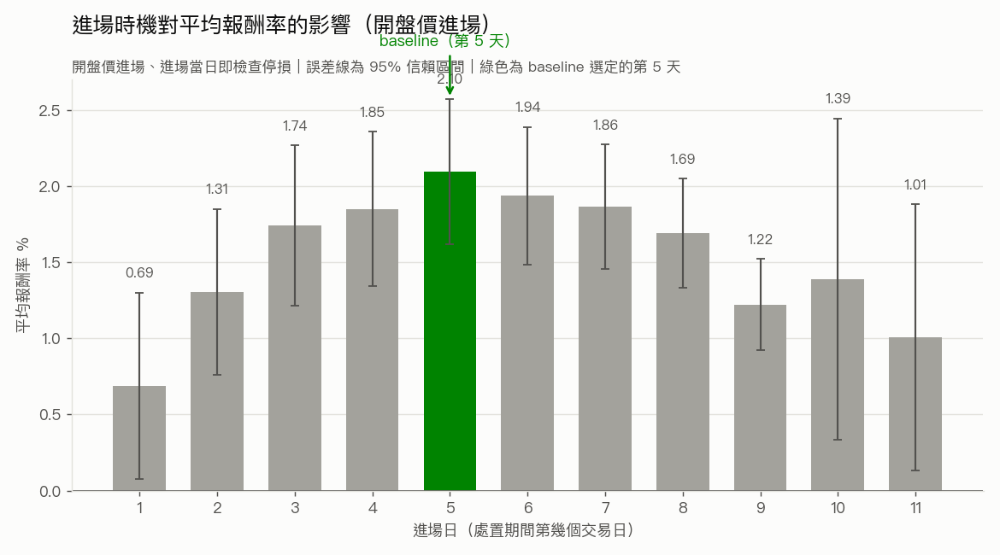

# 處置股做多策略

以台灣證交所／櫃買中心官方公布的**處置股清單**為進場訊號，於處置期間內進場、
持有到出關（`period_end`）出場的做多策略。

**研究期間：2026/07/13 – 2026/07/18**

---

## 最終策略設定

| 參數 | 值 | 說明 |
|---|---|---|
| `entry_day_index` | **5** | 處置期間第 5 個交易日進場 |
| `entry_price_mode` | **open** | 以進場日開盤價成交 |
| `stop_from_entry_day` | **True** | 進場當日即開始檢查停損 |
| 停損 | **9% 動態** | 停損線每日重算 = 前一日收盤 x 0.91 |
| 停損觸發 | 當日盤中最低價 `low <= 停損線` | |
| 停損成交 | `stop_line` | 以停損線成交，再往下扣一次滑價 |
| 出場 | `period_end` 當日收盤價 | 未觸發停損時 |
| 手續費 | 0.001425 x 0.2 折 | 買賣雙邊各收一次 |
| 證交稅 | 0.003（全額） | 僅出場收一次（跨日持倉，無當沖優惠） |
| 滑價 | 0.1% | 基準情境 |
| 本金 | 1,000,000 元／筆 | 連續金額試算 |

---

## 最終績效摘要

| 指標 | 值 |
|---|---|
| 樣本數（交易筆數） | 2,340 |
| 勝率 | 50.7% |
| 停損觸發率 | 37.1% |
| 平均報酬率 | **2.10%** |
| 中位數報酬率 | 0.24% |
| 報酬率標準差 | 11.79% |
| 平均 pnl_ntd | 20,962 |
| 總 pnl_ntd | 49,051,098 |
| 平均持有天數 | 5.07 |

### 進場日的選擇



上圖為**開盤價進場**基礎下（進場當日即檢查停損），各進場日的平均報酬率與
95% 信賴區間。第 5 天在統計上與鄰近幾天（約第 2~8 天）**無顯著差異**——
各組信賴區間彼此重疊。選定第 5 天並非因為它報酬顯著較高，而是在報酬相當的
前提下，**持有天數較短、資金運用效率較高**（詳見 [RESEARCH.md](RESEARCH.md)）。

> **核心警語（請勿省略）：這是在樂觀滑價假設（0.1%）下的結果。**
> 滑價敏感度測試顯示，在 1% 滑價下策略優勢幾乎消失（平均報酬貼近損益兩平，
> 跳空調整後轉負）。處置股為 5／20 分鐘一次的批次集合競價，真實滑價尚未
> 以市場微結構資料估算。**目前不足以支持實盤。**

**Sharpe Ratio 暫不提供**——現行算法將多日持有報酬當成單日報酬年化，
數值不可信；需建立完整每日權益曲線才能計算，此事尚未完成。

---

## 完整研究過程

資料清理 pipeline（L0~L6）、清理過程中的資料發現、回測方法論的演變
（收盤 vs 開盤進場、停損模型修正、9% 動態停損由來）、滑價敏感度完整分析、
進場日從第 4 天改為第 5 天的決策依據，以及所有**已知限制**，
請見 **[RESEARCH.md](RESEARCH.md)**。

---

## 執行方式

```bash
# .env 需設定 FINMIND_TOKEN（Sponsor 層級，處置股清單為付費資料集）
echo 'FINMIND_TOKEN=<your_token>' > .env

python verify_disposition_data.py    # 驗證原始資料格式
python clean_disposition_data.py     # 產出 disposition_events_clean.csv
python event_backtest.py             # 回測、baseline、滑價敏感度
python make_charts.py                # 產出圖表
```

---

## 檔案結構

```
data_loader.py               資料抓取與快取（FinMind API）
clean_disposition_data.py    處置事件清理 pipeline（L1~L6）
verify_disposition_data.py   原始資料格式驗證
event_backtest.py            事件回測引擎（baseline、進場時機掃描、停損、滑價敏感度）
make_charts.py               研究圖表產出
charts/                      輸出圖表（PNG）
data/                        資料快取與輸出（gitignored）
  disposition_events_clean.csv  清理後資料集（2,350 筆已完成事件）
  baseline_summary.csv          baseline 設定與績效摘要
  trade_level.csv               交易明細
RESEARCH.md                  完整研究過程與已知限制
```

> `portfolio_backtest.py` / `signals.py` / `strategy.py` / `backtest.py` /
> `main.py` 屬於既有的**當沖回測引擎**，與本研究無關，全程未修改。
> 該系統的原始說明文件可用 `git show 576616a:README.md` 取回。
