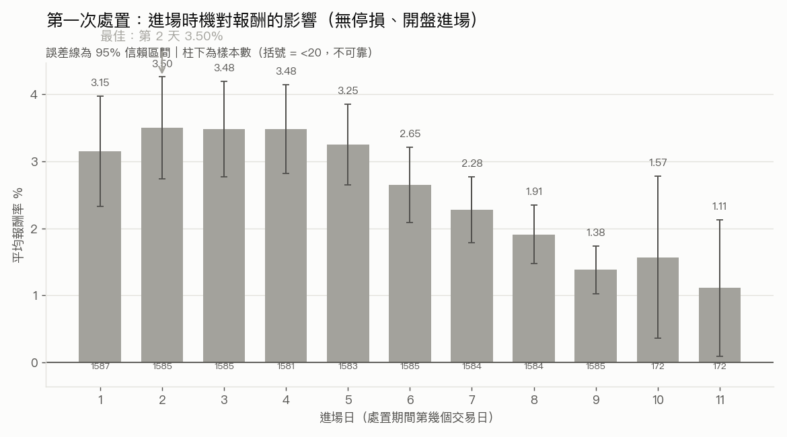
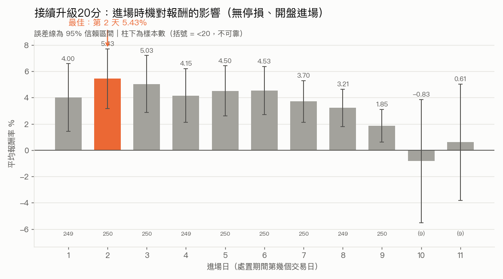
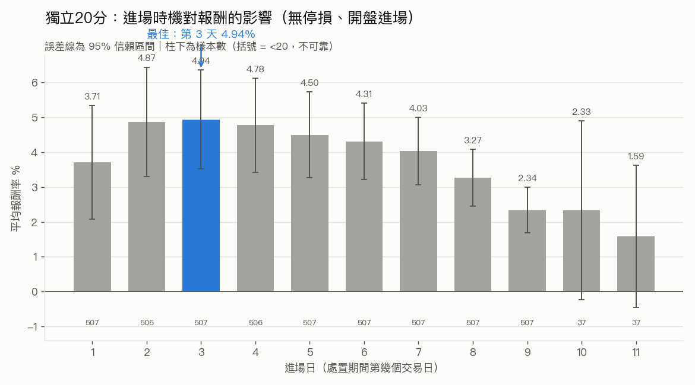

# 處置股做多策略

以台灣證交所／櫃買中心官方公布的**處置股清單**為進場訊號，於處置期間內進場、
持有到出關（`period_end`）出場的做多策略。

**研究時間軸（逐週紀錄）詳見 [RESEARCH.md](RESEARCH.md)。**

---

## 最終策略設定

| 參數 | 值 | 說明 |
|---|---|---|
| `entry_day_index` | **2** | 處置期間第 2 個交易日進場 |
| `entry_price_mode` | **open** | 以進場日開盤價成交 |
| 停損 | **無** | 不設停損，持有至 `period_end` |
| 出場 | `period_end` 當日收盤價 | 抱到出關 |
| 手續費 | 0.001425 x 0.2 折 | 買賣雙邊各收一次 |
| 證交稅 | 0.003（全額） | 僅出場收一次（跨日持倉，無當沖優惠） |
| 滑價 | 0.1% | 基準情境 |
| 本金 | 1,000,000 元／筆 | 連續金額試算 |

> 前一版曾採 9% 動態停損，經配對檢定顯示停損反而提早砍掉回檔的贏家、
> 整體報酬較低（於第 5 天進場下比較：平均 2.10% vs 無停損 3.65%），故改為
> 無停損。9% 停損版本的完整數字與分析見 [RESEARCH.md](RESEARCH.md)「已測試
> 的前版本」。

---

## 最終績效摘要

| 指標 | 值 |
|---|---|
| 樣本數（交易筆數） | 2,340 |
| 勝率 | 58.2% |
| 平均報酬率 | **4.00%** |
| 中位數報酬率 | 2.61% |
| 報酬率標準差 | 16.30% |
| 平均 pnl_ntd | 40,021 |
| 總 pnl_ntd | 93,648,177 |
| 平均持有天數 | 9.19 |

> 無停損換來較高報酬，代價是尾部風險較大——最壞單筆可達 -40% 級的真實崩跌
> （多為投機生技股）。9% 停損可把最壞 30 筆的平均從約 -33% 壓到約 -10%，
> 是報酬與下檔風險的取捨，詳見 [RESEARCH.md](RESEARCH.md)。

### 處置分級三組的績效

依 `disposition_order` 將事件分為三組。**三組都可執行、無 look-ahead bias**——
分組只用下單當下已知的資訊：

| 組別 | 定義 | 樣本數 | 勝率% | 平均% | 中位數% |
|---|---|---|---|---|---|
| 第一次處置 | 第一次處置（**全部**） | 1,583 | 58.7 | 3.25 | 2.29 |
| 接續升級20分 | 第二次以上，緊接自己前次第一次（嚴格重疊） | 250 | 62.4 | 4.50 | 4.17 |
| 獨立20分 | 第二次以上，獨立發生 | 507 | 62.1 | 4.50 | 3.99 |

（上表為 baseline 第 5 天進場的快照；各組完整進場日 1~11 曲線見下方三張圖。）

> **分組修正（look-ahead bias）：** 早期版本曾把第一次處置再細分成「未來沒升級
> 的純5分」與「未來升級的前段」，但**下單當下無法得知這次第一次處置未來會不會
> 升級**，該分法不可執行，故已合併為單一「第一次處置（全部）」。第二／三組的
> 區分只需歷史資訊（本次事件發生時前次處置早已公告），可執行，故保留。

**第一次處置明顯偏弱，接續升級與獨立 20 分表現接近且較強。** 這暗示「是否走到
第二次以上處置」本身才是關鍵訊號——不論它是獨立的第二次處置、還是緊接前次
升級而來，一旦升到 20 分管制，做多後的反彈都明顯優於只被處置一次的股票。
第一次處置很多是「被關一下就放出來」、動能不強；能撐到第二次的通常有更強的
題材與資金推動。

#### 三組各自的進場日曲線

三組分別掃描進場日 1~11（no-stop、開盤進場），最佳進場日並不一致：



*第一次處置（全部）：最佳為第 2 天（3.50%），但第 2~4 天近乎持平（約 3.5%）。*



*接續升級 20 分：最佳為第 2 天（5.43%），前段偏高、後段遞減。*



*獨立 20 分：最佳為第 3 天（4.94%），峰在第 2~3 天。*

**三組的最佳進場日大致一致**（第一次約第 2~4 天持平、接續升級第 2 天、
獨立 20 分第 3 天）。現行 baseline 的 `entry_day_index=2` 正好貼近各組的最佳
進場區間；就整體樣本而言，第 2~6 天彼此的平均報酬差距落在統計雜訊範圍內
（單筆報酬標準差約 16%，遠大於組間差異），選第 2 天不代表它被證明最優。

> **核心警語（請勿省略）：以上數字採 0.1% 的滑價假設，此假設尚未經市場
> 微結構資料驗證。** 處置股為 5／20 分鐘一次的批次集合競價，實際成交價與
> 下單時看到的價格可能有明顯落差；滑價成本一旦高於此假設，報酬會等比例
> 下滑。真實滑價的精確估算尚未完成，**目前不足以支持實盤。**

**Sharpe Ratio 暫不提供**——現行算法將多日持有報酬當成單日報酬年化，
數值不可信；需建立完整每日權益曲線才能計算，此事尚未完成。

---

## 完整研究過程

資料清理 pipeline（L0~L6）、清理過程中的資料發現、回測方法論的演變
（收盤 vs 開盤進場、9% 動態停損由來與移除）、進場日從第 4 天改為第 5 天的
決策依據，以及所有**已知限制**，請見 **[RESEARCH.md](RESEARCH.md)**。

---

## 執行方式

```bash
# .env 需設定 FINMIND_TOKEN（Sponsor 層級，處置股清單為付費資料集）
echo 'FINMIND_TOKEN=<your_token>' > .env

python verify_disposition_data.py    # 驗證原始資料格式
python clean_disposition_data.py     # 產出 disposition_events_clean.csv
python event_backtest.py             # 回測、baseline、滑價敏感度
python make_charts.py                # 產出圖表
```

---

## 檔案結構

```
data_loader.py               資料抓取與快取（FinMind API）
clean_disposition_data.py    處置事件清理 pipeline（L1~L6）
verify_disposition_data.py   原始資料格式驗證
event_backtest.py            事件回測引擎（baseline、進場時機掃描、停損、滑價敏感度）
make_charts.py               研究圖表產出
charts/                      輸出圖表（PNG）
data/                        資料快取與輸出（gitignored）
  disposition_events_clean.csv  清理後資料集（2,350 筆已完成事件）
  baseline_summary.csv          baseline 設定與績效摘要
  trade_level.csv               交易明細
RESEARCH.md                  完整研究過程與已知限制
```

> `portfolio_backtest.py` / `signals.py` / `strategy.py` / `backtest.py` /
> `main.py` 屬於既有的**當沖回測引擎**，與本研究無關，全程未修改。
> 該系統的原始說明文件可用 `git show 576616a:README.md` 取回。
