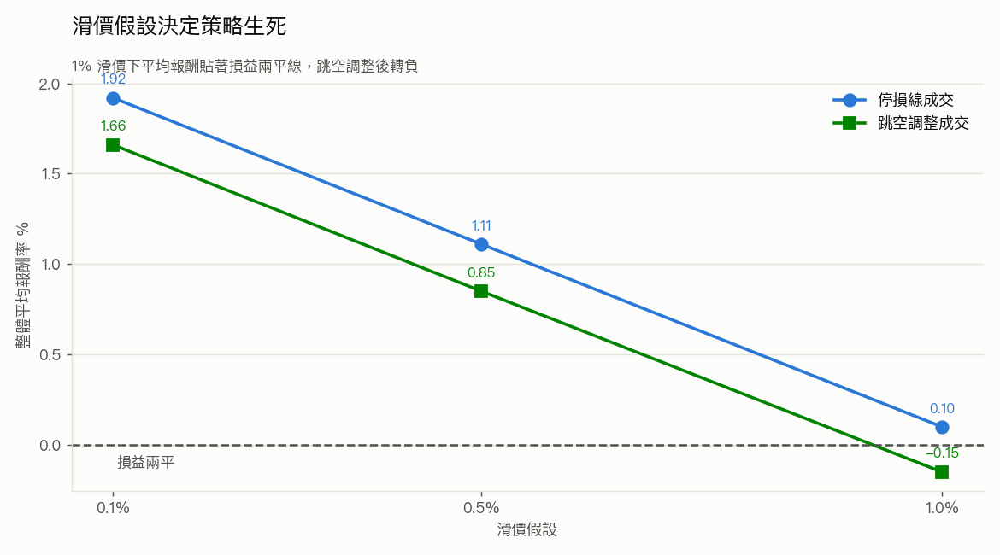
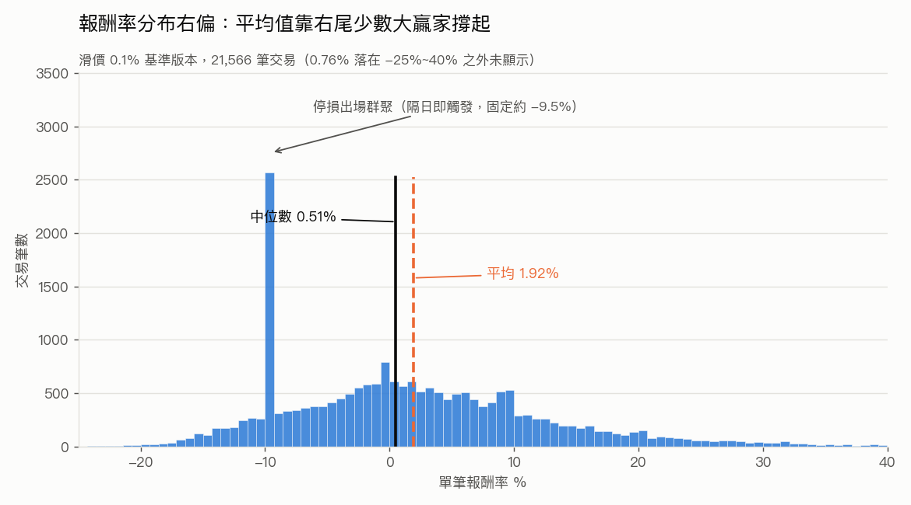

# 處置股做多策略研究

以台灣證交所／櫃買中心官方公布的**處置股清單**為進場訊號，測試處置期間內
不同進場時機、持有到出關（`period_end`）出場的績效表現。

研究期間 2020-01-02 ~ 2026-07-14，最終資料集 **2,384 筆處置事件、877 檔股票**，
展開為 **21,566 筆（事件 x 進場日）** 交易樣本。

> **結論先講**：在樂觀假設下策略有優勢（滑價 0.1% 時平均每筆 +1.92%），
> 但在合理保守的滑價假設下優勢消失（滑價 1% 時 +0.10%，跳空調整後 -0.15%）。
> 目前**尚不足以支持實盤**。下一步應該實際估算處置股批次撮合的真實滑價，
> 而不是繼續調整進出場參數。

---

## 資料來源與處理流程

全部資料來自 **FinMind API**（Sponsor 付費層級）：

| 資料集 | 用途 | 付費 |
|---|---|---|
| `TaiwanStockDispositionSecuritiesPeriod` | 處置股歷史清單 | Sponsor 限定 |
| `TaiwanStockInfo` | 股票基本資料（市場別、產業別） | 免費 |
| `TaiwanStockPrice` | 日K價量資料 | 免費 |
| `TaiwanStockTradingDate` | 真實交易日曆（計算處置期間長度） | 免費 |

### 清理流程

原始 3,970 筆處置紀錄逐層過濾至 2,384 筆：

| 步驟 | 剩餘筆數 | 增減 | 說明 |
|---|---|---|---|
| L0 原始資料 | 3,970 | — | 2020-01-01 ~ 2026-07-15 全市場 |
| L1 只留 twse/tpex | 2,968 | -1,002 | 排除興櫃 166、權證／可轉債等對不到基本資料者 836 |
| L2 正規化 | 2,968 | 0 | condition 分類、disposition_order 判斷（不過濾） |
| L3 只留標準 5/20 分規格 | 2,636 | -332 | 排除變更交易方法(10/25分)、分盤集合競價(45/60分)、無次序資訊者 |
| L4 排除非一般股票 | 2,453 | -183 | 存託憑證 170、創新板 12、ETF 1 |
| L5 只留 10/12 交易日 | **2,384** | -69 | 排除颱風休市導致公告期間未反映順延者 |

**最終資料集組成**：`tpex` 1,480 / `twse` 904；處置期間 10 交易日 2,165 筆、
12 交易日 219 筆（12 日者為當沖加嚴案件）；第一次處置 1,613 筆、
第二次以上 771 筆。

### 清理過程中值得記錄的幾件事

**`condition` 欄位有 16 種原始值，且上市與上櫃用兩套完全不同的書寫系統**
描述同一件事（`連續三次` vs `連續3個營業日`），必須用精確對照表正規化，
不能用字串包含比對。

**`disposition_cnt` 不是「第幾次處置」**，而是該檔的歷史累計處置次數。
真正的處置次序要從 `measure` 判斷：TWSE 用短碼（`第一次處置`／`第二次處置`），
TPEx 用長法條文字，只能靠撮合分鐘數反推（5 分 = 第一次、20 分 = 第二次以上）。
兩者在真股票樣本中**完全互斥、零重疊**——沒有任何一列可用來交叉校準。

**`TaiwanStockInfo` 不是快照表**，而是跨年份累積的多對多標籤（同一檔股票在同一天
可有多列不同 `industry_category`），`date` 欄位是 FinMind 建檔日而非生效日。
因此創新板判斷改用處置資料自身的 `stock_name` 後綴（`-創`／`-KY創`）——那是
事件當下的名稱，比基本資料的時間錯位可靠。（後綴需錨定字尾，否則
`緯創`／`群創`／`鈺創` 等一般公司會被誤殺。）

**處置期間長度由當沖加嚴決定，與處置次序無關**：當沖加嚴 ⟺ 12 交易日
（219/222 一致），非加嚴 ⟺ 10 交易日。

---

## 已知限制

以下限制**尚未解決**，會影響結論的可信度：

- **TWSE 約 1,120 筆事件無法確認是否為標準交易方法。** 這些列的 `measure`
  欄位字串長度剛好 5 個字，只有 `第一次處置`／`第二次處置` 兩種值，
  不含任何規格資訊。以關鍵字掃過（`變更交易方法`／`分盤`／`集合競價`）
  全部 0 命中——但那是因為**欄位裡根本沒有資訊可查**，不是因為它們都是標準規格。
  因此最終資料集的 TWSE 部分**可能仍混有非標準交易方法的股票**，範圍與
  TPEx 那側並未真正一致。要補齊需另抓變更交易方法資料集。

- **興櫃轉上市／上櫃的最多 75 筆事件目前仍被誤排。** L1 用 `TaiwanStockInfo`
  的單一列判斷市場別，但有 156 檔股票的 `type` 會隨時間改變
  （80 檔 emerging→tpex、66 檔 emerging→twse），轉板後才發生的處置事件會被
  當成興櫃濾掉。此問題已定位但未修正：`TaiwanStockInfo` 的 `date` 是建檔日
  而非生效日，2,074 檔股票只有一筆 2026-07 的記錄，直接做 as-of join 會誤刪
  94% 的資料，需要另尋歷史市場別來源。

- **滑價與圈存全額預收等交易摩擦只用簡化假設模擬**，不是實際市場微結構的
  精確估計。處置期間是 5 或 20 分鐘一次的批次集合競價，委託與整個時段的單子
  集中撮合，成交價與下單時看到的價格可能差距很大。**這是整份研究最脆弱的假設。**

- **圈存制度未建模。** 處置期間券商全額預收價金，不能融資、資金效率 1:1。
  不影響單筆報酬率，但會嚴重限制組合層級可同時持有的檔數。

- 回測時有 32 筆事件因出場日無價被跳過（多為 2026-07 剛發布、`period_end`
  尚未到期者），最終涵蓋 2,352 個事件。

---

## 回測方法論

**進場**：對每筆事件，將 `period_start` ~ `period_end` 之間的交易日依序標記
`entry_day_index = 1..trading_days`，掃描第 1 到 `trading_days - 1` 天各自作為
進場日的績效（最後一天當進當出無意義故排除）。進場價為該日**收盤價**。

**出場**：固定在 `period_end` 當日**收盤價**，不隨進場日改變。

**停損（9% 動態）**：
- 停損線每日重算：`stop_line(t) = close(t-1) x (1 - 0.09)`，
  進場隔日的 `close(t-1)` 即進場日收盤價
- 觸發判斷：當日**盤中最低價** `low <= stop_line(t)`
- 觸發成交價：當日停損線，再往下扣一次滑價
- 未觸發則更新前一日收盤價，繼續檢查下一天；一路未觸發才抱到 `period_end`
- 停牌（無資料）的日子跳過，不以前一日價格替代

**跳空調整（`gap_adjusted`）**：停損出場中有 18.5% 是開盤即已跳空跌破停損線，
此時不可能在停損線成交。此模式改以 `min(停損線, 當日開盤價)` 成交，
用來量化「停損線成交」假設的樂觀程度。

---

## 成本假設

| 項目 | 值 | 說明 |
|---|---|---|
| 手續費率 | 0.001425 x 0.2 折 = **0.000285** | 買賣雙邊各收一次 |
| 證交稅 | **0.003** | 全額，僅出場收一次（跨日持倉，不適用當沖折扣稅率） |
| 滑價 | **0.1% / 0.5% / 1.0%** | 敏感度測試三檔；進場價往上加、出場價往下減 |

進出場同價的成本損耗約 -0.56%（滑價 0.1% 時）。

---

## 主要發現

### 1. 進場時機：第 2~6 天最佳，且彼此無統計顯著差異


第 4 天平均 2.61% 為名目最高，但**第 2~6 天的 95% 信賴區間彼此重疊**
（2.20~2.61%，區間半寬 0.44~0.54pp），統計上分不出高下。誠實的結論是
「第 2~6 天之間看不出差異」，不是「第 4 天最好」。

兩端則明顯較差，且信賴區間與最佳區間**不重疊**：

- **第 1 天最差（1.68%）**：曝險 7.31 天，停損觸發率高達 **53.5%**，
  超過一半的部位在行情發動前就被掃出場
- **第 9 天以後（0.42% / 0.99% / -0.00%）**：只剩 2 天曝險，吃不到行情

（圖中第 7~8 天為過渡帶，未納入藍色標示區間；第 10~11 天僅 218 筆樣本，
只有 12 日處置事件才存在，信賴區間明顯較寬。）

### 2. 停損機制：越晚進場停損率越低，這是機械性的


停損觸發率隨進場日單調遞減（53.5% → 9.8%），純粹因為曝險天數變少
（7.31 天 → 2.17 天）。勝率則反向緩升（45.6% → 57.0%）。
最佳進場時機落在中段，正是這兩股力量抵消的結果。

**停損模型的修正過程本身是一個重要發現。** 最初版本用「收盤價跌破停損線觸發、
卻以停損線價格成交」，這在邏輯上不成立——收盤價既然已在停損線下方，
就不可能還用停損線的價格賣出。修正為「盤中低點觸發」後，整體平均報酬從
**虛高的 3.34% 修正為 1.92%**。該假設憑空生出的 1.92pp 假獲利，
比滑價從 0.1% 拉到 1% 的影響（1.85pp）還大。

同時停損從 2% 固定放寬為 9% 動態：2% 對波動 10%+ 的處置股而言不是風控而是
隨機出場，觸發率 52.5%、中位數報酬直接等於停損值（-2.54%）。改為 9% 後
觸發率降至 31.7%，中位數由負轉正。

### 3. 滑價是決定策略生死的關鍵假設



| 停損成交模式 | 滑價 0.1% | 滑價 0.5% | 滑價 1.0% |
|---|---|---|---|
| 停損線成交 | **1.92%** | 1.11% | **0.10%** |
| 跳空調整成交 | 1.66% | 0.85% | **-0.15%** |

滑價每增加 0.4~0.5pp 就吃掉約 0.8~0.9pp 報酬——**這個斜率比報酬本身還陡**，
因為進出場各扣一次，而單筆平均只賺 1.9%。1% 滑價下策略貼著損益兩平線，
扣掉任何未建模的成本就是負的。

**策略的獲利完全依賴「處置股能否以接近收盤價成交」這個未經實證的假設。**

（停損成交模式的影響穩定在 0.26pp，三種滑價下皆然——跳空只佔停損的 18.5%
且幅度不大。這個假設不重要，與上述 close/stop_price 矛盾不是同一量級。）

### 4. 報酬分布右偏，對執行品質高度敏感



中位數 0.51% 遠低於平均 1.92%，**正的平均值主要靠右尾少數大贏家支撐**
（P90 約 +20%，最大 +117%）。而在滑價 0.5% 時**中位數就已轉負**（-0.29%），
代表典型交易已在賠錢，只剩尾部撐住平均。

這種分布對實際執行品質極度敏感：只要漏接幾筆大贏家（而處置股的大贏家
往往正是最難成交的漲停鎖死標的），實際績效就會遠低於回測。

左側 -9.5% 處的尖峰是停損出場群聚——進場隔日即觸發者，出場價恰為
`entry x 0.91`，故固定落在同一點。

---

## 結論與後續建議

**目前的回測結果不足以支持實盤。** 策略在樂觀假設下有優勢（+1.92%），
但在合理保守的滑價假設下優勢消失（+0.10% ~ -0.15%）。研究過程中兩次
發現「看似有效」的績效其實來自模型假設的漏洞——第一次是停損出場價的
邏輯矛盾（虛增 1.92pp），第二次是滑價假設過於樂觀——這提醒我們
**在確認假設成立之前，任何參數優化都是在雜訊上做文章**。

**下一步應該是實際估算處置股批次撮合的真實滑價**，而不是繼續調整進出場參數。
可行方向：用 FinMind 的分價量表或逐筆成交資料，估算處置期間 5/20 分鐘
批次撮合的實際價差與衝擊成本。在那之前，上面每一張表的每一列都只是
假設的函數。

其餘待辦，按優先順序：

1. 補齊變更交易方法資料集，解決 TWSE 1,120 筆規格無法驗證的缺口
2. 尋找歷史市場別資料來源，修正興櫃轉板最多 75 筆的誤排
3. 建模圈存全額預收對組合層級資金效率的限制
4. 檢視漲停鎖死標的的可成交性（進場日漲停鎖死者僅佔 1.1%，
   實測對績效影響僅 0.04pp，但實盤上這些正是最難買到的標的）

---

## 檔案結構

```
data_loader.py               資料抓取與快取（FinMind API）
clean_disposition_data.py    處置事件清理 pipeline（L1~L5）
verify_disposition_data.py   原始資料格式驗證
event_backtest.py            事件回測引擎（進場時機掃描、停損、滑價敏感度）
make_charts.py               研究圖表產出
charts/                      輸出圖表（PNG）
data/                        資料快取與輸出（gitignored）
  disposition_events.csv        原始處置清單（3,970 筆）
  disposition_events_clean.csv  清理後資料集（2,384 筆）
  trade_level.csv               交易明細（21,566 筆）
```

> `portfolio_backtest.py` / `signals.py` / `strategy.py` / `backtest.py` /
> `main.py` 屬於既有的**當沖回測引擎**，與本研究無關，全程未修改。
> 該系統的原始說明文件可用 `git show 576616a:README.md` 取回。

## 執行方式

```bash
# .env 需設定 FINMIND_TOKEN（Sponsor 層級，處置股清單為付費資料集）
echo 'FINMIND_TOKEN=<your_token>' > .env

python verify_disposition_data.py    # 驗證原始資料格式
python clean_disposition_data.py     # 產出 disposition_events_clean.csv
python event_backtest.py             # 回測與滑價敏感度
python make_charts.py                # 產出圖表
```
