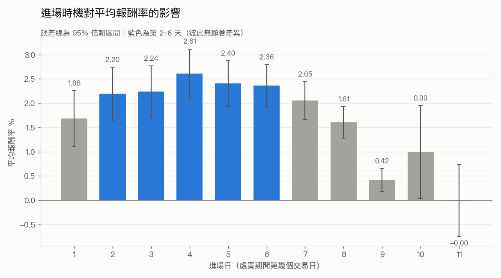
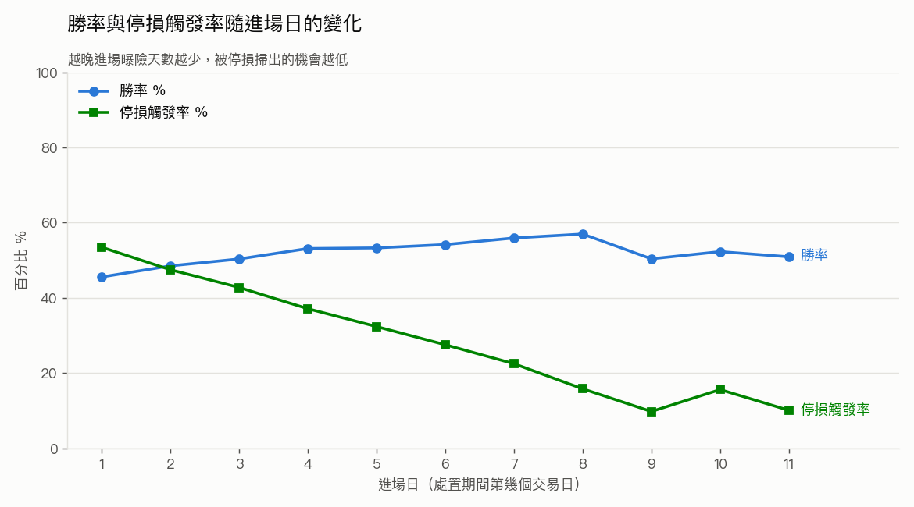

# 處置股做多策略 — 完整研究過程

本文件記錄策略的完整研究過程：資料來源與清理、清理過程中的發現、回測方法論
的演變、進場日選擇的決策依據，以及所有已知限制。

最終策略設定與績效摘要見 **[README.md](README.md)**。

> **一句話結論**：現行 baseline（第 2 天開盤進場、無停損）在 0.1% 滑價假設下
> 有正報酬優勢（整體平均約 4%），但該滑價假設尚未以市場微結構資料驗證；
> 處置股為批次撮合，實際滑價可能顯著較高。目前尚不足以支持實盤。

---

## 研究時間軸

以週為單位記錄實際進度；新工作往下加新區塊，不覆蓋舊紀錄。

### 2026/07/13 – 2026/07/19

- 建立處置股資料清理 pipeline（L1~L6）：市場別過濾、只留標準 5/20 分規格、
  排除 DR／ETF／創新板、只留 10/12 交易日、只留已完成事件；一併修正交易
  日曆幽靈日與 `TaiwanStockInfo` 的時間性問題。
- 建立事件回測引擎；baseline 鎖定為**第 5 天進場、開盤價、9% 動態停損**
  （停損線每日重算、盤中低點觸發）。
- 進場日 1~11 掃描、滑價敏感度分析、Sharpe 算法缺陷檢討。
- `stop_basis` 對照（`trailing_daily` vs `entry_fixed`）——測試後維持
  `trailing_daily`（差異不顯著）。
- 拆分 README（策略）與 RESEARCH（過程）兩份文件。
- （commits：371d3c4、89d236a、ff64ded、c6bcf13）

### 2026/07/20 – 2026/07/26

- **注意股歷史資料管線**：實測 TWSE／TPEx 官網帶日期端點，抓取 2020–2026
  全歷史；multi-hot 款號編碼（市場前綴 `twse_/tpex_`）、數值欄清洗；修復
  TPEx 第十三款全形括號解析 bug、以及 TWSE 限流／timeout 的退避重試漏洞。
- **baseline 改為無停損**：查證 2924（東凌-KY）的 -100% 為資料錯誤
  （period_end 當日收盤記為 0）；配對 t 檢定顯示 9% 停損無顯著優勢
  （反而提早砍掉回檔的贏家），故移除停損。
- **處置分級三組分析**：先發現並修正 look-ahead bias（「這次是否未來升級」
  在下單當下不可知），改為可執行版本——第一次處置／接續升級20分／獨立20分。
- **進場日由第 5 天改為第 2 天**（無停損下整體平均與總 pnl 略高、且更貼近
  三組各自的最佳進場區間）；移除過期的滑價敏感度分析段落。
- **早期做多訊號探索（連兩天第一款）**：獨立於主策略的提早進場版，TWSE／TPEx
  分開套用正確關鍵價公式、限 4 碼普通股、扣 BASELINE 成本；詳見下方獨立章節。
  程式碼在 job tmp、未進 repo。
- （commits：0e30a60、44f4b55、91105b5、e3751c5、+本週後續）

---

## 資料來源

全部資料來自 **FinMind API**（Sponsor 付費層級）：

| 資料集 | 用途 | 付費 |
|---|---|---|
| `TaiwanStockDispositionSecuritiesPeriod` | 處置股歷史清單 | Sponsor 限定 |
| `TaiwanStockInfo` | 股票基本資料（市場別、產業別） | 免費 |
| `TaiwanStockPrice` | 日K價量資料 | 免費 |
| `TaiwanStockTradingDate` | 交易日曆（計算處置期間長度） | 免費 |

---

## 資料清理 pipeline（L0~L6）

原始 3,970 筆處置紀錄逐層過濾至 2,350 筆已完成事件：

| 步驟 | 剩餘筆數 | 增減 | 說明 |
|---|---|---|---|
| L0 原始資料 | 3,970 | — | 2020-01-01 ~ 2026-07-15 全市場 |
| L1 只留 twse/tpex | 2,968 | -1,002 | 排除興櫃 166、權證／可轉債等對不到基本資料者 836 |
| L2 正規化 | 2,968 | 0 | condition 分類、disposition_order 判斷（不過濾） |
| L3 只留標準 5/20 分規格 | 2,636 | -332 | 排除變更交易方法(10/25分)、分盤集合競價(45/60分)、無次序資訊者 |
| L4 排除非一般股票 | 2,453 | -183 | 存託憑證 170、創新板 12、ETF 1 |
| L5 只留 10/12 交易日 | 2,354 | -99 | 排除颱風／休市導致公告期間未反映順延者 |
| L6 只留已完成事件 | **2,350** | -4 | 排除 `period_end >= 今天` 的 in-flight 事件 |

**最終資料集組成**：`tpex` 1,467 / `twse` 883；處置期間 10 交易日 2,132 筆、
12 交易日 218 筆（12 日者為當沖加嚴案件）；第一次處置 1,592 筆、
第二次以上 758 筆。共 871 檔股票，事件公告日 2020-01-02 ~ 2026-06-25。

### 樣本數的兩個口徑（避免混淆）

- **事件數 2,350**：`disposition_events_clean.csv` 的列數。
- **交易筆數 2,340**：baseline（第 2 天進場）實際產生的交易。差額來自個別
  股票在進場日或出場日停牌而跳過的事件——這是正確的略過，非資料錯誤。

L6 用「`period_end` 嚴格早於今天」為界，確保：(a) 不使用尚未收盤定案的當日
價格；(b) 樣本只會因為**新處置事件發生**而變多，不會因既有事件補到出場價而
悄悄漂移。修正前曾出現 baseline 在未改動程式下自行從 2,344 漂移到 2,349 的
可重複性問題，即由此而來。

---

## 清理過程中的資料發現

**`condition` 欄位有 16 種原始值，且上市與上櫃用兩套完全不同的書寫系統**
描述同一件事（`連續三次` vs `連續3個營業日`），必須用精確對照表正規化，
不能用字串包含比對。

**`disposition_cnt` 不是「第幾次處置」**，而是該檔的歷史累計處置次數。
真正的處置次序要從 `measure` 判斷：TWSE 用短碼（`第一次處置`／`第二次處置`），
TPEx 用長法條文字，只能靠撮合分鐘數反推（5 分 = 第一次、20 分 = 第二次以上）。
兩者在真股票樣本中**完全互斥、零重疊**——沒有任何一列可用來交叉校準。

**`TaiwanStockInfo` 不是快照表**，而是跨年份累積的多對多標籤（同一檔股票在同一天
可有多列不同 `industry_category`），`date` 欄位是 FinMind 建檔日而非生效日。
因此創新板判斷改用處置資料自身的 `stock_name` 後綴（`-創`／`-KY創`）——那是
事件當下的名稱，比基本資料的時間錯位可靠。（後綴需錨定字尾，否則
`緯創`／`群創`／`鈺創` 等一般公司會被誤殺。）

**處置期間長度由當沖加嚴決定，與處置次序無關**：當沖加嚴 ⟺ 12 交易日
（219/222 一致），非加嚴 ⟺ 10 交易日。

**`TaiwanStockTradingDate` 會誤列休市日。** 2026-07-10 出現在交易日曆中，
但以台積電、鴻海、聯發科、中華電、台泥五檔權值股交叉驗證，該日全數無價
（全市場無交易）。全期間 1,609 個日曆交易日中，此為唯一的幽靈交易日。
交易日曆載入時以參照股票的實際價格資料驗證並剔除此類錯誤日，否則跨越該日
的事件 `trading_days` 會多算一天、`entry_day_index` 對位錯誤。

---

## 回測方法論

**進場**：對每筆事件，將 `period_start` ~ `period_end` 之間的交易日依序標記
`entry_day_index = 1..trading_days`，掃描第 1 到 `trading_days - 1` 天各自作為
進場日的績效（最後一天當進當出無意義故排除）。

**出場**：固定在 `period_end` 當日收盤價（未觸發停損時）。

**停損（9% 動態）**：
- 停損線每日重算：`stop_line(t) = close(t-1) x (1 - 0.09)`
- 觸發判斷：當日**盤中最低價** `low <= stop_line(t)`
- 觸發成交價：當日停損線，再往下扣一次滑價
- 未觸發則更新前一日收盤價，繼續檢查下一天；一路未觸發才抱到 `period_end`
- 停牌（無資料）的日子跳過，不以前一日價格替代

### 進場價：收盤 → 開盤

早期回測（含進場日掃描）以**收盤價**進場。實際執行計畫改為**開盤價**進場後，
兩者有系統性落差：處置期間股價傾向往上，「當天開盤買、比前一天收盤貴」，
故開盤進場整體壓低報酬。此外開盤進場代表**進場當日整天都持有部位**，該日盤中
低點是真實風險，故 `stop_from_entry_day=True`，進場當日即檢查停損。

搭配一個防呆：若進場當日開盤已跌破停損線，代表是在停損線下方買進的，不可能
再以停損線賣出（否則停損反被記成獲利），一律改以開盤價成交。

### 停損模型的修正（一個重要發現）

最初版本用「收盤價跌破停損線觸發、卻以停損線價格成交」，這在邏輯上不成立——
收盤價既然已在停損線下方，就不可能還用停損線的價格賣出。修正為「盤中低點
觸發」後，整體平均報酬從**虛高的 3.34% 修正為 1.92%**。該假設憑空生出的
1.92pp 假獲利，比滑價從 0.1% 拉到 1% 的影響（1.85pp）還大。

同時停損從 2% 固定放寬為 9% 動態：2% 對波動 10%+ 的處置股而言不是風控而是
隨機出場，觸發率 52.5%、中位數報酬直接等於停損值（-2.54%）。改為 9% 後
觸發率降至 31.7%，中位數由負轉正。

### 跳空調整（`gap_adjusted`）

停損出場中有 18.5% 是開盤即已跳空跌破停損線，此時不可能在停損線成交。
此模式改以 `min(停損線, 當日開盤價)` 成交，用來量化「停損線成交」假設的
樂觀程度。（此為前版 9% 停損期的分析；現行 baseline 已無停損。）

### 已測試的前版本：9% 動態停損（現已移除）

現行 baseline **不設停損**（持有至 `period_end`）。在此之前曾以 9% 動態停損
（每日以前一日收盤重算停損線、盤中低點觸發、進場當日即檢查）作為 baseline，
後經比較後移除。兩版並列（其餘參數相同：第 5 天開盤價進場、滑價 0.1%）：

| 版本 | 樣本數 | 勝率% | 平均% | 中位數% | 平均pnl_ntd | 總pnl_ntd | 平均持有天數 |
|---|---|---|---|---|---|---|---|
| 9% 動態停損（前版本） | 2,340 | 50.7 | 2.10 | 0.24 | 20,962 | 49,051,098 | 5.07 |
| **無停損（現行 baseline）** | 2,340 | 59.8 | **3.65** | 2.88 | 36,524 | 85,465,816 | 6.19 |

**移除停損的理由**：對每筆交易的 `pnl差值 = 無停損 − 有停損` 做**配對 t 檢定**
（2,340 筆，1,224 筆兩版結果相同）——雖然差異在統計上不顯著（p≈0.15、
95% CI 含 0），但點估計與機制一致地指向「移動停損在這種高波動、傾向上漲的
處置股上，砍掉的贏家比擋掉的輸家更多」。以「只有一方停損」的 588 筆拆解：
只有停損版出場的 310 筆，在無停損下最終平均 **+8.24%**（是被提早砍掉的贏家）；
只有無停損版下跌到 -9% 的 278 筆才是真虧損（平均 -3.03%）。前者數量多於後者，
故移除停損整體較優。

**代價是尾部風險**：無停損下最壞 30 筆平均 -33%，9% 停損可壓到 -10%。最壞單筆
多為真實崩跌（2020 投機生技股如合一、中天、杏國約 -40%）。另有 1 筆
（2924 東凌-KY，2022-03）顯示 -100%，經查為**資料錯誤**——該股 period_end
當日（2022-03-17）OHLC 記為 0，實際前後日均在 34 元正常交易、未下市（同代號
後更名宏太-KY）。此假象拉低無停損平均約 0.04pp，影響極小，故保留於數字中。

### 停損基準：每日重算 vs 進場價固定（已測試的替代方案，屬前版停損期）

現行 baseline 的停損線每日重算（`trailing_daily`），跟著前一日收盤價走。
另測試一個對照組 `entry_fixed`：停損線全程固定為 `entry_price x (1 - 0.09)`，
不隨股價變動。除停損基準外，其餘參數一律沿用 baseline（第 5 天開盤價進場、
進場當日即檢查停損、9% 停損）。

| 停損基準 | 樣本數 | 勝率% | 停損觸發率% | 平均% | 中位數% | 平均持有天數 | 平均pnl_ntd | 總pnl_ntd |
|---|---|---|---|---|---|---|---|---|
| `trailing_daily`（每日重算，**baseline**） | 2,340 | 50.7 | 37.1 | 2.10 | 0.24 | 5.07 | 20,962 | 49,051,098 |
| `entry_fixed`（進場價固定） | 2,340 | 50.8 | 35.7 | 2.29 | 0.31 | 5.09 | 22,947 | 53,696,401 |

**機制**：`entry_fixed` 的停損線固定在進場價下方 9%，不會隨股價上漲往上抬，
因此不會提早砍到還在賺錢的部位；`trailing_daily` 的移動停損會跟著股價走，
一個大賺的部位只要從近期高點回檔 9% 就會被停損出場。

以「只有一方觸發停損」的 588 筆交易為例，這個差異看得很清楚：

- **只有 `trailing_daily` 停損的 310 筆**，在 `entry_fixed` 下最終**平均 +8.24%**
  ——它們是**贏家**，被移動停損在回檔時提早砍掉。
- **只有 `entry_fixed` 停損的 278 筆**，在 `trailing_daily` 下最終**平均 -3.03%**
  ——它們是**真虧損**（緩跌到 -9%），移動停損的線跟著下滑而沒抓到。

也就是說，兩種停損抓的是不同族群：`trailing_daily` 傾向砍掉回檔的贏家，
`entry_fixed` 傾向抓住緩跌的輸家。`entry_fixed` 的名目報酬略高（+0.19pp），
但差異微小、量級不足以支持切換。

> **`entry_fixed` 為已測試的替代方案，目前 baseline 維持 `trailing_daily` 不變。**
> 值得在日後與其他改動（例如放寬停損、變更出場邏輯）合併時重新評估。

---

## 進場時機分析

> **注意（與現行 baseline 的關係）：** 本節記錄的是進場日選擇的**演變過程**，
> 圖表與數字來自前一版（9% 停損、部分為收盤價進場）的全樣本掃描，當時據此
> 選定第 5 天。**現行 baseline 已改為無停損、第 2 天進場**——在無停損下整體
> 樣本第 2 天平均報酬與總 pnl 略高於第 5 天，且三組分級掃描中各組最佳進場日
> 都落在第 2~3 天。以下段落保留作為決策軌跡，其「選第 5 天」的結論已被取代。

> 下列圖表以收盤價進場、全進場日掃描的版本產生，用於呈現進場時機的形狀。

### 第 2~6 天最佳，且彼此無統計顯著差異

收盤價進場下，第 4 天平均 2.61% 為名目最高，但**第 2~6 天的 95% 信賴區間
彼此重疊**（2.20~2.61%，區間半寬 0.44~0.54pp），統計上分不出高下。誠實的
結論是「第 2~6 天之間看不出差異」，不是「第 4 天最好」。兩端則明顯較差：
第 1 天曝險久、停損率高達 53.5%；第 9 天以後只剩 2 天曝險，吃不到行情。

### 停損觸發率隨進場日的變化（機械性）

停損觸發率隨進場日單調遞減（越晚進場曝險越少），勝率反向緩升。最佳進場
時機落在中段，正是這兩股力量抵消的結果。

### 最佳進場日會隨進場價格基準改變

以**開盤價進場（當日即檢查停損）**重跑全進場日掃描後，最佳點右移：

| entry_day_index | 開盤_平均% | 開盤排名 | 收盤_平均% | 收盤排名 | 開盤-收盤 |
|---|---|---|---|---|---|
| 1 | 0.69 | 11 | 1.67 | 7 | -0.98 |
| 2 | 1.31 | 8 | 2.20 | 5 | -0.89 |
| 3 | 1.74 | 5 | 2.25 | 4 | -0.51 |
| 4 | 1.85 | 4 | 2.63 | 1 | -0.78 |
| **5** | **2.10** | **1** | 2.41 | 2 | -0.31 |
| 6 | 1.94 | 2 | 2.36 | 3 | -0.42 |
| 7 | 1.86 | 3 | 2.06 | 6 | -0.20 |
| 8 | 1.69 | 6 | 1.62 | 8 | +0.07 |
| 9 | 1.22 | 9 | 0.42 | 10 | +0.80 |
| 10 | 1.39 | 7 | 0.99 | 9 | +0.40 |
| 11 | 1.01 | 10 | -0.00 | 11 | +1.01 |

收盤版第 4 天名目最高、開盤版第 5 天名目最高。差異來自處置期間的**動能**：
早進場時「開盤價比前一天收盤貴」的懲罰最重（第 1 天 -0.98pp、第 2 天 -0.89pp），
越晚該懲罰越小甚至轉為紅利，因而把最佳點往後推。**這代表進場日的選擇會受
進場價格基準影響，不是固定不變的。**

### 為何前一版 baseline 曾選第 5 天（已改為第 2 天）

> 以下為前一版（9% 停損）的選擇理由，**現行 baseline 已改為第 2 天**（見本節
> 開頭注意）。保留作為決策軌跡。

- 開盤進場下第 5 天名目報酬最高（2.10%），但與第 3~8 天（1.74%~1.94%）的差距
  全都落在統計雜訊範圍內——單筆報酬標準差約 12%，遠大於這些組間差異。
  選第 5 天**不是因為它被證明統計上最優**。
- 在報酬彼此相當的前提下，選第 5 天而非第 4 天是為了**資金效率**：晚一天進場、
  持有天數較短（5.07 vs 5.60 天），資金週轉較快。
- 可確定的只有：此中段區帶顯著優於第 1 天（停損率 53.5%）與第 9 天之後
  （曝險不足）。

（後續改用第 2 天：無停損下整體第 2 天平均 4.00% 略高於第 5 天 3.65%、總 pnl
+9.6%，且更貼近三組各自的最佳進場區間；代價是平均持有天數較長。）

---

## Sharpe Ratio 為何暫不提供

現行以「每日實現損益 / 每日名目曝險」計算 Sharpe 的算法，直接套用會得到
不可信的高值（曾算出 5.47），因為：
1. 每個序列點是平均約 6 個交易日的**持有報酬**，卻被當成單日報酬乘 √252 年化；
2. 每個出場日跨多筆事件平均，稀釋了標準差；
3. 沒有出場的日子不計入序列，等於刪掉了「沒賺沒賠」的波動。

要得出可信數字，需建立涵蓋每一個交易日、計入**未平倉部位市值變動**的完整
每日權益曲線，並以真實資金上限決定同時可持有的檔數（這會撞上圈存全額預收
的限制）。此事尚未完成。

---

## 2026/07/20 – 2026/07/26

> 以下各節（款號組合分析、第一款方向拆分、第 2／11 款方向排除結論）為本週
> 新增的研究內容。此標題以上的章節為前一週（或更早）的既有內容。

## 款號組合分析

處置事件由注意股「款號」觸發（第 1~8 款，見 `analyze_clauses.py`）。以事件
公告時已存在的歷史注意股紀錄反推款號集合——**無 look-ahead**（回溯窗口內的
注意紀錄早於處置公告）。標記結果存於 `data/disposition_events_with_clauses.csv`。

### 單一款號 vs 組合：第 6 款可能是「搭配型」增強因子

單一款號邊際表現（現行 baseline：第 2 天、開盤、無停損；允許重疊）中，
第 6 款（量能／週轉異常）平均 5.63%、第 2 款 5.56% 最突出。但攤開成**具體
組合**後有個關鍵發現：

- **單獨只命中第 6 款的 147 筆，平均只有 3.37%**（組合 `(6)`），
  明顯低於「含第 6 款」的邊際數字 5.63%。
- 差距來自第 6 款**與其他款同時出現**的組合被拉高：`(1,6)` 14.70%、
  `(1,4,6)` 6.68%、`(2,6)` 5.12%、`(2,4,6)`、`(4,6)` 6.59% 等。

也就是說，第 6 款的高邊際報酬有相當部分是「第 6 款搭配其他款一起出現」時
才強，**單獨出現(只有第 6 款)並沒有特別好**。這暗示第 6 款可能是「搭配型」
增強因子，而非單獨有效的訊號。（注意：多數多款組合樣本數偏小，見下表
交易次數欄自行判斷可信度。）

### 完整組合表（41 種，按總 pnl_ntd 由高到低）

損益比 = 獲利交易平均獲利 ÷ 虧損交易平均虧損（絕對值），以 pnl_ntd 計；
`inf` = 全部獲利無虧損、`0` = 全部虧損無獲利（多為交易次數 1~3 的組合）。
完整資料另存 `data/clause_combo_table.csv`。

| 組合 | 交易次數 | 總pnl_ntd | 平均pnl_ntd | 平均% | 中位數% | 勝率% | 損益比 |
|---|---|---|---|---|---|---|---|
| (1) | 1,850 | 68,711,549 | 37,141 | 3.71 | 2.22 | 57.0 | 1.38 |
| (6) | 147 | 4,956,161 | 33,715 | 3.37 | 3.02 | 63.9 | 1.30 |
| (2) | 76 | 4,496,380 | 59,163 | 5.92 | 2.19 | 61.8 | 2.04 |
| (1,6) | 19 | 2,792,351 | 146,966 | 14.70 | 12.23 | 73.7 | 4.91 |
| (1,2,4) | 17 | 2,363,775 | 139,046 | 13.90 | 14.36 | 82.4 | 1.45 |
| (1,4,6) | 25 | 1,670,841 | 66,834 | 6.68 | 8.78 | 60.0 | 2.28 |
| (1,3,4,6) | 7 | 1,333,881 | 190,554 | 19.06 | 13.62 | 100.0 | inf |
| (2,6) | 26 | 1,330,622 | 51,178 | 5.12 | 3.63 | 61.5 | 1.89 |
| (1,2,4,6) | 22 | 1,248,229 | 56,738 | 5.67 | 5.20 | 63.6 | 1.45 |
| (2,4) | 16 | 1,176,588 | 73,537 | 7.35 | 7.16 | 68.8 | 2.51 |
| (4,6) | 9 | 592,687 | 65,854 | 6.59 | 4.51 | 77.8 | 2.05 |
| (1,2,3,5) | 3 | 549,705 | 183,235 | 18.32 | 7.91 | 66.7 | 2.47 |
| (1,2,4,5,6) | 3 | 416,663 | 138,888 | 13.89 | 8.97 | 66.7 | 3.10 |
| (1,3,4,7) | 2 | 403,503 | 201,752 | 20.18 | 20.18 | 100.0 | inf |
| (1,2,5,6) | 1 | 359,918 | 359,918 | 35.99 | 35.99 | 100.0 | inf |
| (2,3,4) | 3 | 324,792 | 108,264 | 10.83 | 11.62 | 66.7 | 7.81 |
| (1,3,4) | 27 | 297,364 | 11,014 | 1.10 | -0.56 | 48.1 | 1.27 |
| (1,2,3,4,6) | 6 | 274,061 | 45,677 | 4.57 | 3.10 | 66.7 | 1.74 |
| (1,2,6) | 4 | 267,184 | 66,796 | 6.68 | 7.49 | 75.0 | 1.18 |
| (1,2) | 7 | 227,776 | 32,540 | 3.25 | -2.52 | 42.9 | 2.37 |
| (2,4,6) | 4 | 225,934 | 56,484 | 5.65 | 6.33 | 100.0 | inf |
| (1,3,5) | 2 | 190,242 | 95,121 | 9.51 | 9.51 | 100.0 | inf |
| (1,4,5,6) | 1 | 165,279 | 165,280 | 16.53 | 16.53 | 100.0 | inf |
| (1,2,5) | 3 | 156,097 | 52,032 | 5.20 | 8.62 | 66.7 | 0.91 |
| (1,3,4,5) | 5 | 142,862 | 28,573 | 2.86 | 8.56 | 80.0 | 0.34 |
| (1,3,4,5,6) | 3 | 113,308 | 37,769 | 3.78 | 3.87 | 66.7 | 2.34 |
| (1,3,4,6,7) | 1 | 110,629 | 110,629 | 11.06 | 11.06 | 100.0 | inf |
| (1,2,3,4,5) | 8 | 108,060 | 13,508 | 1.35 | -1.53 | 50.0 | 1.22 |
| (1,3) | 5 | 66,422 | 13,284 | 1.33 | 5.83 | 60.0 | 0.88 |
| (1,4,5) | 1 | 57,152 | 57,153 | 5.72 | 5.72 | 100.0 | inf |
| (1,3,4,5,7) | 1 | 48,193 | 48,194 | 4.82 | 4.82 | 100.0 | inf |
| (2,4,5) | 1 | 12,705 | 12,705 | 1.27 | 1.27 | 100.0 | inf |
| (2,3,4,5,6) | 1 | 8,852 | 8,852 | 0.89 | 0.89 | 100.0 | inf |
| (3,4) | 1 | -64,752 | -64,753 | -6.48 | -6.48 | 0.0 | 0 |
| (3,5) | 1 | -76,794 | -76,795 | -7.68 | -7.68 | 0.0 | 0 |
| (1,2,4,5) | 5 | -94,100 | -18,820 | -1.88 | -4.21 | 40.0 | 1.12 |
| (3,4,6) | 1 | -98,305 | -98,306 | -9.83 | -9.83 | 0.0 | 0 |
| (1,2,3) | 2 | -113,217 | -56,609 | -5.66 | -5.66 | 50.0 | 0.01 |
| (1,2,3,4,7) | 1 | -179,586 | -179,587 | -17.96 | -17.96 | 0.0 | 0 |
| (1,4) | 5 | -338,444 | -67,689 | -6.77 | -4.74 | 0.0 | 0 |
| (1,2,3,4) | 16 | -650,334 | -40,646 | -4.06 | -4.13 | 31.2 | 0.81 |

（另有 2 筆事件查無對應注意紀錄、無款號組合，未列入表中。）

### 第 6 款「含 vs 不含」獨立雙樣本檢定

以全部 2,340 筆分「含第 6 款 vs 不含」兩獨立組（非成對）：含第 6 款 280 筆
平均 5.63%、不含 2,060 筆平均 3.78%，差 +1.85pp。Welch t-test p=0.028、
Mann-Whitney U p=0.0096，**兩種檢定皆顯著**——第 6 款是統計上站得住的報酬
增強因子。對照第 2 款（含 225 筆 5.56% vs 不含 3.84%，差 +1.72pp）：
Welch p=0.103、Mann-Whitney p=0.135，**皆未達顯著**。兩款點估計相近，但
只有第 6 款經得起檢定。

### 第一款方向拆分：漲觸發 vs 跌觸發（目前最強的發現）

第一款是「累積漲跌幅異常」，方向可從注意股 raw_info 原文乾淨辨識——每筆
第一款注意紀錄都明確寫「漲幅」或「跌幅」（TWSE/TPEx 各數千筆，0 筆兩者
都有、0 筆都沒有）。join 到有第一款的處置事件後，可明確分向的 2,052 筆中
**漲:跌 ≈ 1,873:179（約 91%:9%）**。以現行 baseline（第 2 天、開盤、無停損）
分別計算績效：

| 組 | 交易次數 | 總pnl_ntd | 平均pnl_ntd | 平均% | 中位數% | 勝率% | 損益比 |
|---|---|---|---|---|---|---|---|
| 漲觸發 | 1,865 | 64,514,978 | 34,592 | 3.46 | 2.02 | 56.0 | 1.37 |
| **跌觸發** | 178 | 16,410,942 | **92,196** | **9.22** | **7.98** | **71.9** | 1.69 |

**跌觸發（暴跌後被處置的股票，做多買反彈）平均 9.22%、中位數 7.98%、
勝率 71.9%，全面優於漲觸發約 2.7 倍**，且中位數同步高（非右尾撐起）。

**下檔檢查（跌觸發最差 20 筆）：** 最壞單筆 -35.95%（杏國，2020 生技崩盤那批），
但只有前 4 筆超過 -29%，第 20 筆已是 -8%；沒有 -100% 這類資料錯誤或歸零。
下檔量級與整體策略的最壞案例相近，但這組平均報酬高一倍多——**高報酬不是靠
壓低尾部風險換來的**。

**分散度驗證（跌觸發特別小心，因只有 178 筆）：**

- 178 筆交易來自 **127 檔不同公司**（非少數幾檔反覆），出現 1 次的有 94 檔
  （74%）、2 次以上僅 33 檔；唯一極端值是金麗科（3228）出現 9 次。
- 拿掉出現最多的金麗科／杏國／得利影（15 筆）後，剩 163 筆平均**不降反升到
  10.81%**、中位數 9.15%——這三檔正是下檔榜常客、屬負貢獻，可見 9.22% 不依賴
  任何單一標的。
- 最保守的「每檔只取一筆事件」（127 檔）平均仍有 **8.97%**、中位數 7.25%。

> **這是目前為止樣本可信度最高、效果最明顯的發現**：訊號明確（漲跌方向可從
> 原文 100% 辨識、無 look-ahead）、效果大（跌觸發平均報酬約為漲觸發 2.7 倍）、
> 且通過分散度與下檔檢驗。**值得後續考慮是否納入實際下單邏輯**（例如只做或
> 加碼跌觸發）。此處僅記錄，尚未據此修改 BASELINE_CONFIG——跌觸發樣本
> 178 筆仍偏小，正式納入前建議再看跨年份／跨市場的穩定度。

### 其他款號的方向拆分：查證後排除

依官方要點，第 1~5、7 款的判定基礎理論上都含收盤價漲跌%，可能都有方向。
但**親眼查注意股 raw_info 原文後，只有第 1 款能拆出有意義的跌側**。逐款結論：

- **第 2 款（期間起迄漲跌幅）**：文字確實寫「漲幅／跌幅」可辨識，但**實際
  資料 100% 只在上漲側觸發**——TWSE 2,761 筆、TPEx 2,728 筆全含漲幅、
  **0 跌幅**；join 到我們 226 筆有第 2 款的事件也全是漲。**無跌側可拆。**
- **第 3、4、5 款**：實際判定文字分別是**成交量放大／週轉率／券商買賣比率**
  （量級或券商方向），**不是價格漲跌**，無漲/跌方向可言（TPEx 有時把漲幅
  綁進同款文字，但那是複合條件、非該款基礎）。第 5 款可用「券商買進 vs
  賣出」拆，但語意不等同價格方向。
- **第 11 款（起迄兩日價差）**：**兩所寫法不同**——TWSE 以「當日收盤價為
  最近六日**最高者／最低者**」表方向（可辨識），TPEx 只有絕對價差（無方向）。
  但納入標記 join 到事件後，**跌側（最低者）只有 7 筆**（漲側最高者 85 筆），
  樣本太小不可比。因價差創新低被列注意的股票很少累積到被處置。

| 款 | 能拆方向？ | 我們事件的方向分布 | 可用？ |
|---|---|---|---|
| 第 1 款 | 是（漲幅／跌幅） | 漲 1,873 / 跌 179 | ✅ 唯一可拆 |
| 第 2 款 | 是（漲幅／跌幅） | 漲 226 / 跌 0 | ❌ 無跌側 |
| 第 3／4／5 款 | 否（量能／週轉／券商） | — | ❌ 非價格方向 |
| 第 11 款（TWSE） | 是（最高者／最低者） | 漲 85 / 跌 7 | ❌ 跌側太小 |
| 第 11 款（TPEx） | 否（純價差） | — | ❌ 無方向 |

**結論：方向拆分這條路，實質上只有第一款走得通。** 這也是上市／上櫃需分開
處理的又一例（第 11 款 TWSE 可拆、TPEx 不可拆）。

---

## 早期做多訊號探索：連兩天第一款

> **性質：探索性、獨立於主策略。** 程式碼在 job tmp（`liansan_long.py` /
> `liansan_long_net.py`）**未進 repo**，未動 `BASELINE_CONFIG` / `event_backtest.py`。
> 主策略是「處置公告後進場、持有約 9 天」；這條訊號是它的**提早進場版**——
> 不等處置公告，在升級途中就進場，只持有 1 天。以下數字純屬探索，正式使用前
> 需另建可重複執行的程式碼。

### 訊號定義

連續 2 個營業日被**第 1 款**列注意的股票，第 3 天（day3）盤中股價摸到**重建的
官方關鍵價**即進場做多，**隔日（day4）收盤出場**。關鍵價依市場分開，用各自
正確的門檻公式（`base` = day3 往前 6 個交易日收盤價）：

- **TWSE**：`key = min(base×1.32, max(base×1.25, base+50))`
- **TPEx**：`key = min(base×1.30, max(base×1.23, base+40))`

進場條件為 day3 最高價 `high ≥ key`（盤中摸得到）；報酬 = (day4 收盤 − key) / key。
無 look-ahead：篩選只用注意股資料與當日之前的價量。

### 樣本範圍：限定 4 碼普通股

**只保留 4 碼普通股，排除 5–6 碼權證／TDR。** 權證會製造**離群報酬的假象**：
未過濾時 2024 年 TWSE 的平均報酬被單筆 **+17,324%** 的權證暴衝股撐到 **71.56%**，
但中位數只有 6.86%。剔除權證後同年平均回落到 **8.58%**（中位數 6.13%），才是
誠實水準。逐年淨績效因此更平滑，右尾假象消失。

### 成本模型

完全比照 `BASELINE_CONFIG`：手續費 `0.001425 × 0.2 折 = 0.000285`（單邊，進出
各收一次）、證交稅 `0.003`（僅出場收一次）、滑價 `0.001`（進場價往上、出場價
往下）。每筆固定拖累約 **0.61pp**（主要是稅 0.3% + 雙邊滑價 0.2%，費用僅 0.057%）。
扣成本前後：**勝率降約 2pp、中位數降約 0.6pp**——貼近損益兩平的邊際交易翻負，
但核心 edge 完整存活。

### 逐年淨績效（已扣成本，4 碼普通股）

**TWSE（1,449 筆）**

| 年 | 進場 | 勝率% | 平均% | 中位數% | 總pnl_ntd |
|---|---|---|---|---|---|
| 2020 | 361 | 72.0 | 11.21 | 9.14 | 40,472,082 |
| 2021 | 336 | 73.2 | 8.10 | 6.00 | 27,204,394 |
| 2022 | 146 | 74.0 | 7.56 | 5.21 | 11,039,650 |
| 2023 | 139 | 68.3 | 6.36 | 5.39 | 8,841,720 |
| 2024 | 292 | 74.0 | 8.58 | 6.13 | 25,040,831 |
| 2025 | 175 | 68.0 | 6.76 | 4.78 | 11,832,551 |
| **全部** | 1,449 | 72.0 | 8.59 | **6.21** | 124,431,231 |

**TPEx（2,529 筆）**

| 年 | 進場 | 勝率% | 平均% | 中位數% | 總pnl_ntd |
|---|---|---|---|---|---|
| 2020 | 555 | 72.4 | 10.29 | 6.51 | 57,107,661 |
| 2021 | 620 | 75.5 | 10.41 | 7.94 | 64,524,784 |
| 2022 | 191 | 72.3 | 7.54 | 5.28 | 14,398,242 |
| 2023 | 328 | 75.6 | 8.82 | 6.58 | 28,916,872 |
| 2024 | 462 | 75.1 | 8.74 | 6.35 | 40,359,978 |
| 2025 | 373 | 71.3 | 6.66 | 5.16 | 24,853,140 |
| **全部** | 2,529 | 73.9 | 9.10 | **6.40** | 230,160,679 |

勝率兩市場各年穩定在 68–76%（含 2022 空頭年 72–74%），中位數 ~5–8%。TPEx 進場
數較多，因門檻較低（1.30/1.23+40）、關鍵價較低、盤中較易摸到。

### 執行風險檢查

- **關鍵價貼近漲停 = 0%**（六年皆 0）：關鍵價不會落在漲停（前收+10%）附近，
  盤中摸得到、不必買在鎖死價。
- **全日鎖死漲停**（day3 high=low，實際買不到）：TWSE 6.8%、TPEx 6.8%。
- 排除鎖死後可執行子集（淨）：**TWSE 1,350 筆 勝率 70.4%、中位數 5.23%**；
  **TPEx 2,356 筆 勝率 72.4%、中位數 5.46%**。

### 有進處置 vs 沒進處置（可執行子集，淨報酬）

「有進處置」= 該股 period_start 落在 day3 前後 [−5, +20] 交易日內。

| 市場 | 組別 | 筆數 | 勝率% | 平均% | 中位數% | 總pnl_ntd |
|---|---|---|---|---|---|---|
| TWSE | 有進處置(76%) | 1,031 | 76.4 | 8.10 | 6.63 | 83,481,157 |
| TWSE | 沒進處置(24%) | 319 | 50.8 | 3.39 | 0.32 | 10,810,155 |
| TPEx | 有進處置(77%) | 1,809 | 77.2 | 8.39 | 6.65 | 151,724,608 |
| TPEx | 沒進處置(23%) | 547 | 56.5 | 3.78 | 1.25 | 20,686,866 |

### 核心結論

這本質上是**主策略的提早進場版**：不等處置公告，在第 3 天摸到門檻就進——
**提早約 2–4 天，持有期 1 天 vs 主策略約 9 天**。約 76–77% 的訊號股最終真的
變成正式處置事件，兩者高度重疊。

**edge 集中在「有進處置」那組**（兩市場淨勝率 76–77%、中位數 ~6.6%），是穩健
核心。**「沒進處置」那組扣成本後幾乎打平**（TWSE 淨中位數僅 0.32%、勝率跌破
51%），正報酬全靠少數右尾撐；但事前無法分辨一筆會不會進處置，且右尾偶有貢獻，
因此不建議額外過濾。

**明確標註**：以上純屬探索，**未來若要正式使用需另建可重複執行的程式碼**。
本節不影響、也未修改 `BASELINE_CONFIG` / `event_backtest.py`。

---

## 已知限制

以下限制**尚未解決**，會影響結論的可信度：

- **滑價與圈存全額預收等交易摩擦只用簡化假設模擬**，不是實際市場微結構的
  精確估計。處置期間是 5 或 20 分鐘一次的批次集合競價，委託與整個時段的單子
  集中撮合，成交價與下單時看到的價格可能差距很大。**這是整份研究最脆弱的假設。**

- **圈存制度未建模。** 處置期間券商全額預收價金，不能融資、資金效率 1:1。
  不影響單筆報酬率，但會嚴重限制組合層級可同時持有的檔數，也使 `總pnl_ntd`
  （各筆獨立投入 100 萬的加總）無法直接視為可實現的總報酬。

- **TWSE 約 1,120 筆事件無法確認是否為標準交易方法。** 這些列的 `measure`
  欄位只有 `第一次處置`／`第二次處置` 兩種值，不含任何規格資訊。以關鍵字
  掃過（`變更交易方法`／`分盤`／`集合競價`）全部 0 命中——但那是因為欄位裡
  根本沒有資訊可查。因此最終資料集的 TWSE 部分**可能仍混有非標準交易方法的
  股票**，範圍與 TPEx 那側並未真正一致。要補齊需另抓變更交易方法資料集。

- **興櫃轉上市／上櫃的最多 75 筆事件目前仍被誤排。** L1 用 `TaiwanStockInfo`
  的單一列判斷市場別，但有 156 檔股票的 `type` 會隨時間改變
  （80 檔 emerging→tpex、66 檔 emerging→twse），轉板後才發生的處置事件會被
  當成興櫃濾掉。此問題已定位但未修正：`TaiwanStockInfo` 的 `date` 是建檔日
  而非生效日，直接做 as-of join 會誤刪 94% 的資料，需另尋歷史市場別來源。

---

## 結論與後續建議

**目前的回測結果不足以支持實盤。** 策略在樂觀假設下有優勢，但在合理保守的
滑價假設下優勢消失。研究過程中兩次發現「看似有效」的績效其實來自模型假設的
漏洞——第一次是停損出場價的邏輯矛盾（虛增 1.92pp），第二次是滑價假設過於
樂觀——這提醒我們**在確認假設成立之前，任何參數優化都是在雜訊上做文章**。

**下一步應該是實際估算處置股批次撮合的真實滑價**，而不是繼續調整進出場參數。
可行方向：用 FinMind 的分價量表或逐筆成交資料，估算處置期間 5/20 分鐘批次
撮合的實際價差與衝擊成本。在那之前，上面每一張表的每一列都只是假設的函數。

其餘待辦，按優先順序：

1. 補齊變更交易方法資料集，解決 TWSE 1,120 筆規格無法驗證的缺口
2. 尋找歷史市場別資料來源，修正興櫃轉板最多 75 筆的誤排
3. 建模圈存全額預收對組合層級資金效率的限制
4. 建立完整每日權益曲線，計算可信的 Sharpe Ratio 與最大回撤
5. 檢視漲停鎖死標的的可成交性（進場日漲停鎖死者僅佔 1.1%，實測對績效影響
   僅 0.04pp，但實盤上這些正是最難買到的標的）
